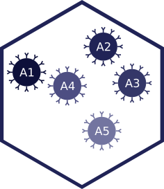

# beadplexr 

[](https://gitlab.com/ustervbo/beadplexr/commits/master)
[](https://gitlab.com/ustervbo/beadplexr/commits/master)
[](https://cran.r-project.org/package=beadplexr)
[](http://doi.org/10.7717/peerj.5794)


Reproducible and easy analysis and evaluation of LEGENDplex, CBA, and MACSPlex experiments.

The companies behind the above beadplex systems, provide their own software for the analysis of the generated data. However, the strong dependence on manual interaction make the respective solutions labour insensitive and above all not always reproducible.

## Installation

From CRAN:

```
install.packages("beadplexr")
```

Or the development version from GitLab:

``` 
# install.packages("devtools")
devtools::install_git("https://gitlab.com/ustervbo/beadplexr")
#
# Or with vignettes built
# devtools::install_git("https://gitlab.com/ustervbo/beadplexr", build_vignettes = TRUE)
```

`beadplexr` depends on the `nloptr` package. During the installation of `nloptr` on an Unix/Linux system, the `nlopt` library should be autimatically downloaded and installed. If this fails, installing the library with 


```
sudo apt-get install libnlopt-dev
```

should make it possible to complete the installation of `beadplexr`.


## Getting started

```
library(beadplexr)
```

The package comes with a comprehensive example in the vignette 'Analysis of LEGENDplex data with beadplexr':

```
vignette("legendplex-analysis", package = "beadplexr")
```

Or read the vignette [here](https://cran.r-project.org/web/packages/beadplexr/vignettes/legendplex-analysis.html).

## Citing the package

Please cite as:

Stervbo U, Westhoff TH, Babel N (2018). “beadplexr: Reproducible and automated analysis of multiplex bead assays.” _PeerJ_, *6*, e5794.
ISSN 2167-8359, doi: [10.7717/peerj.5794](http://doi.org/10.7717/peerj.5794)

Get the reference [BibTex format here](./inst/CITATION).
