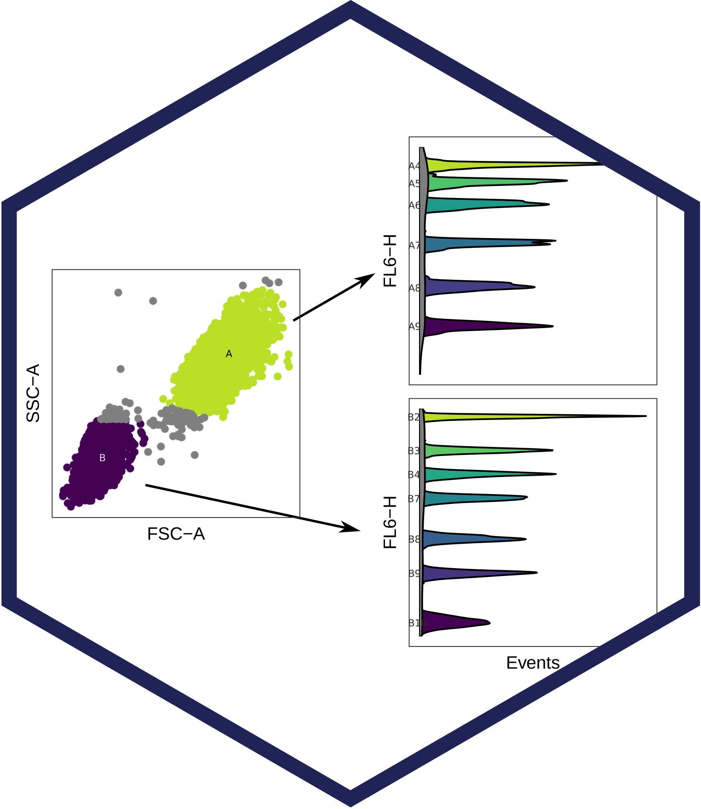

# beadplexr 

<!-- [](https://gitlab.com/ustervbo/beadplexr/commits/master) -->

<!-- [](https://gitlab.com/ustervbo/beadplexr/commits/master) -->

<!-- [](https://cran.r-project.org/package=beadplexr) -->

<!-- [](http://doi.org/10.7717/peerj.5794) -->

Reproducible and easy analysis and evaluation of LEGENDplex, CBA, and MACSPlex experiments.

The companies behind the above beadplex systems, provide their own software for the analysis of the generated data. However, the strong dependence on manual interaction make the respective solutions labor-intensive and above all not always reproducible.

## Installation

From CRAN:

```         
install.packages("beadplexr")
```

Or the development version from GitLab:

```         
# install.packages("devtools")
devtools::install_git("https://gitlab.com/ustervbo/beadplexr")
#
# Or with vignettes built
# devtools::install_git("https://gitlab.com/ustervbo/beadplexr", build_vignettes = TRUE)
```

`beadplexr` depends on several packages with system requirements. On an Unix/Linux system the libraries can be installed with

```         
sudo apt install \
    libnlopt-dev \
    libfontconfig1-dev \
    libharfbuzz-dev libfribidi-dev \
    libfreetype6-dev libpng-dev libtiff5-dev libjpeg-dev
```

For other systems, please see the documentation of the individual packages:

-   [`nloptr`](https://CRAN.R-project.org/package=nloptr) (needs libnlopt-dev)
-   [`systemfonts`](https://CRAN.R-project.org/package=systemfonts) (needs libfontconfig1-dev)
-   [`textshaping`](https://CRAN.R-project.org/package=textshaping) (needs libharfbuzz-dev libfribidi-dev)
-   [`ragg`](https://CRAN.R-project.org/package=ragg) (needs libfreetype6-dev libpng-dev libtiff5-dev libjpeg-dev)

## Getting started

```         
library(beadplexr)
```

The package comes with a comprehensive example in the vignette 'Analysis of LEGENDplex data with beadplexr':

```         
vignette("legendplex_analysis", package = "beadplexr")
```

<!-- Or read the vignette [here](https://CRAN.R-project.org/package=beadplexr/vignettes/legendplex_analysis.html). -->

## Citing the package

Please cite as:

Stervbo U, Westhoff TH, Babel N (2018). "beadplexr: Reproducible and automated analysis of multiplex bead assays." *PeerJ*, *6*, e5794. ISSN 2167-8359, doi: [10.7717/peerj.5794](https://doi.org/10.7717/peerj.5794)

Get the reference [BibTex format here](./inst/CITATION).
